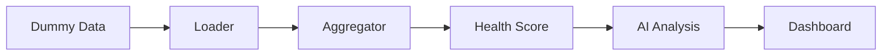

# Customer Intelligence Dashboard

A lightweight, AI-assisted internal dashboard for Sales and Customer Success teams to understand a customer in a few seconds.

## Overview

This project aggregates CRM, email, support, Slack, and product usage signals into a single customer brief. The dashboard surfaces health, urgency, risks, opportunities, recommendations, and supporting evidence.

## Run locally

```bash
pip install -r requirements.txt
streamlit run app.py
```

## Architecture



## Project structure

- `app.py` — Streamlit application entrypoint
- `data/` — generated JSON source data
- `services/` — modular business logic
- `prompts/` — AI prompt templates
- `assets/` — static UI assets

## Features

- Automatic dummy data generation
- Aggregated customer profile view
- Deterministic business health scoring
- AI-generated customer brief
- Evidence-backed recommendations
- Timeline visualization

## Limitations

- Uses generated dummy data rather than real integrations.
- AI output depends on the configured OpenAI-compatible endpoint.
- Designed as a lightweight demonstration app.

## Future improvements

- Real CRM integrations
- Real email and Slack APIs
- Authentication and role-based access
- Historical analytics and predictive churn modeling
- PDF export and CSV uploads

## License

This project is provided for assessment/demo purposes.
